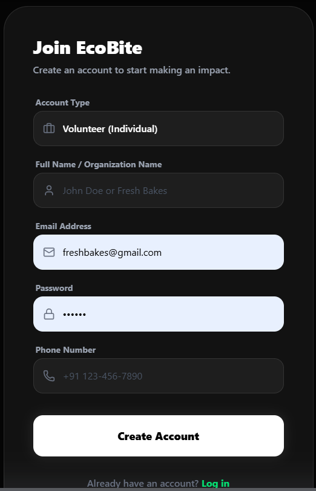
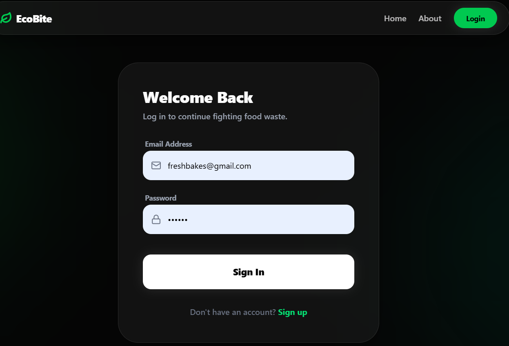
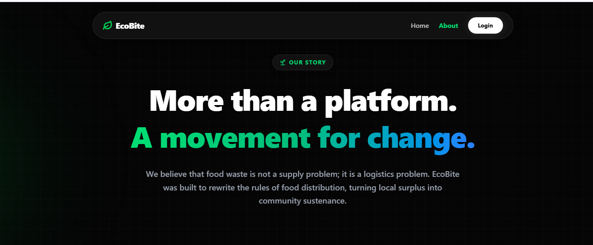
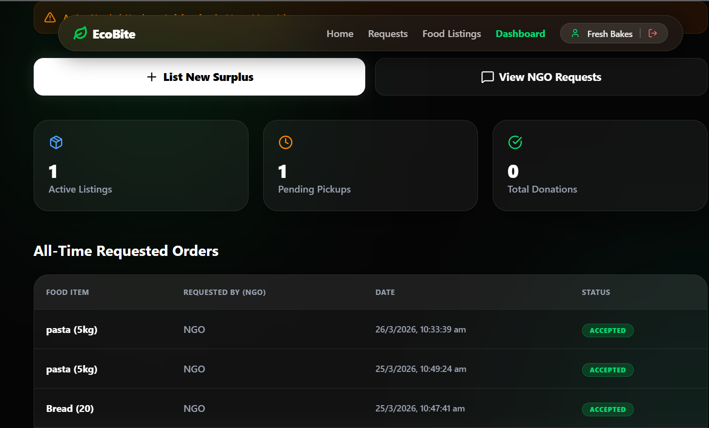
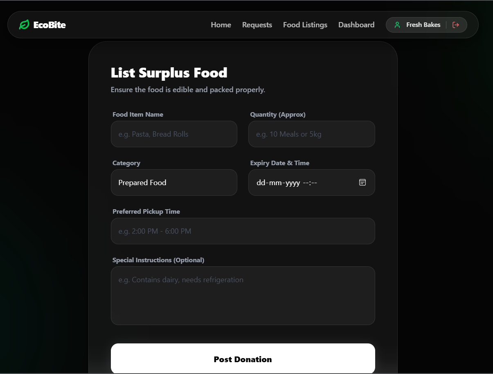
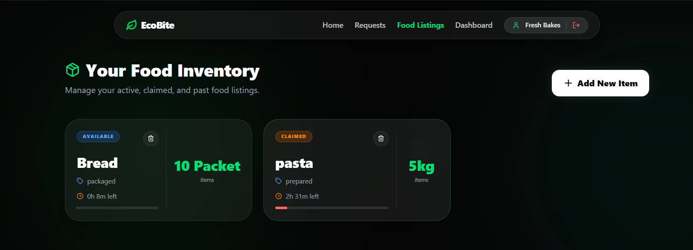
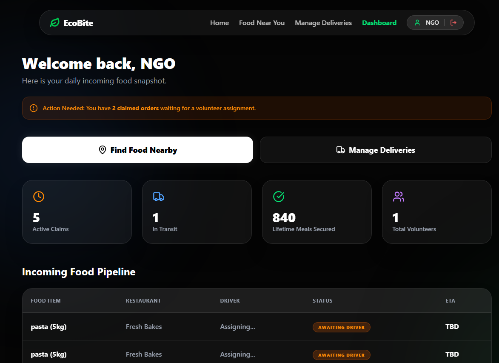
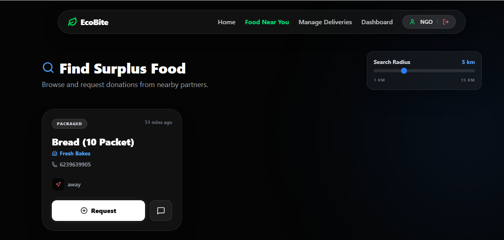
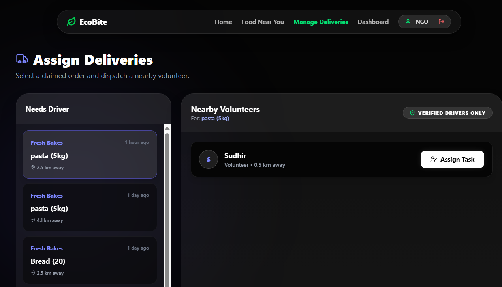
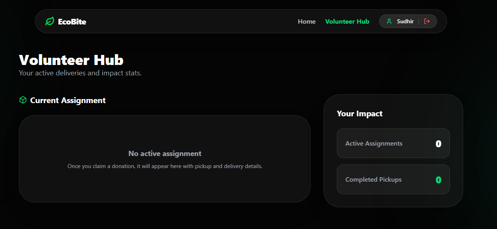

# 🌱 EcoBite – Smart Food Waste Management Platform

EcoBit is a full-stack web application designed to reduce food wastage by connecting restaurants with NGOs and volunteers. Restaurants can donate surplus food, NGOs can request it, and volunteers help in delivering it to people in need.

---

## 🚀 Features

### 🍽️ For Restaurants

* Add surplus food donations
* Manage food listings
* View incoming requests from NGOs
* Accept or reject food requests

### 🤝 For NGOs

* Browse available food nearby
* Request food donations
* View request status (Pending / Accepted / Rejected)
* Chat with restaurants for coordination
* View restaurant contact details (phone number)

### 🚚 For Volunteers

* View assigned pickups
* Manage delivery tasks

---

## 🛠️ Tech Stack

### Frontend

* React.js
* Custom CSS (No Tailwind)
* Axios

### Backend

* Node.js
* Express.js

### Database

* MySQL
* Sequelize ORM

### Authentication

* JWT (JSON Web Tokens)

---

## 📂 Project Structure

```
frontend/         → React frontend
backend/         → Backend (Node.js + Express)
models/         → Sequelize models
routes/         → API routes
controllers/    → Business logic
```

---

## ⚙️ Installation & Setup

### 1️⃣ Clone the repository

```bash
git clone https://github.com/your-username/ecobit.git
cd ecobit
```

---

### 2️⃣ Setup Backend

```bash
cd backend
npm install
```

Create a `.env` file inside `server/`:

```
PORT=3000
DB_NAME=your_database_name
DB_USER=root
DB_PASSWORD=your_password
JWT_SECRET=your_secret_key
```

Run backend server:

```bash
npm start
```

---

### 3️⃣ Setup Frontend

```bash
cd frontend
npm install
npm run dev
```

---

## 🔗 API Endpoints

### Auth

* POST `/api/auth/register`
* POST `/api/auth/login`

### Food

* GET `/api/food/available`
* POST `/api/food`
* DELETE `/api/food/:id`

### Requests

* POST `/api/requests`
* GET `/api/requests`

---

## 💡 Key Functionalities

* 🔐 Secure authentication using JWT
* 🔄 Real-time-like updates using polling
* 📞 Restaurant contact sharing (phone number)
* 💬 Chat system between NGO and restaurant
* 📦 Food request lifecycle management

---

## 📸 Screenshot

### 🔐 Authentication

#### 📝 Register Page


#### 🔑 Login Page


---

### ℹ️ About Section

#### 📖 About Us Page


---

### 🍽️ Restaurant Features

#### 🏠 Restaurant Dashboard


#### ➕ Add Food Donation


#### 📋 Food Listings (Manage Food)


---

### 🤝 NGO Features

#### 🏢 NGO Dashboard


#### 🔍 Food Near You


#### 📊 Request Status Page


---

### 🚚 Volunteer Features

#### 🚛 Manage Deliveries


---

---

## 🌟 Future Improvements

* 🔥 Real-time chat using Socket.io
* 📍 Google Maps integration for distance calculation
* 📲 WhatsApp integration for quick contact
* 🔔 Notification system (request updates)
* 📊 Admin dashboard

---


## ⭐ Support

If you like this project, please give it a ⭐ on GitHub!

---
